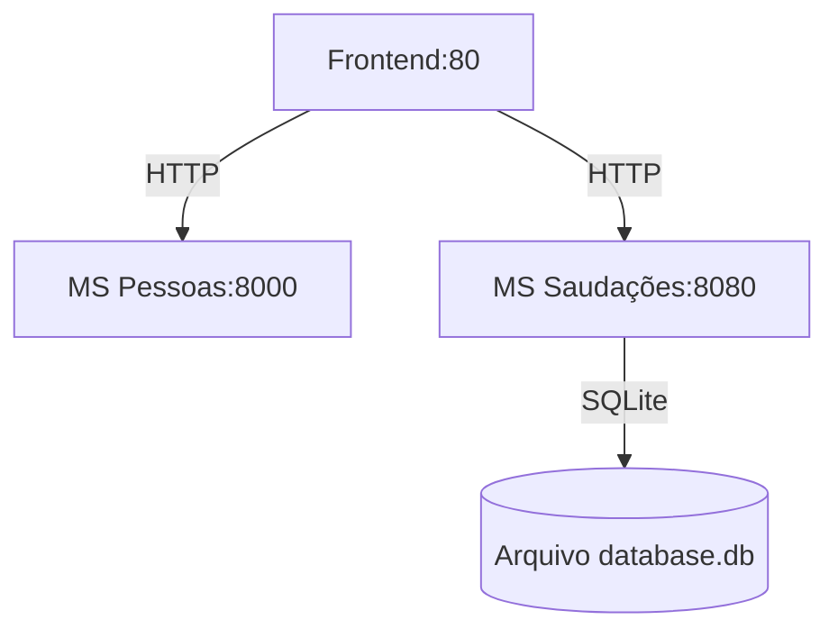

# Projeto de Desafio Docker - Documentação

## Visão Geral
Aplicação composta por três serviços containerizados:
1. Frontend estático (Nginx)
2. Microsserviço de Pessoas (Python/FastAPI)
3. Microsserviço de Saudações (Go/SQLite)

## Estrutura do Projeto
```plaintext
.
├── docker-compose.yaml
├── frontend/
│   ├── Dockerfile
│   └── index.html
├── ms-pessoas/
│   ├── Dockerfile
│   ├── main.py
│   └── requirements.txt
└── ms-saudacoes/
    ├── Dockerfile
    ├── main.go
    └── go.mod
```

## Arquivos de Configuração

### Dockerfiles

#### Frontend (`frontend/Dockerfile`)
```dockerfile
FROM nginx:alpine
COPY . /usr/share/nginx/html
EXPOSE 80
CMD ["nginx", "-g", "daemon off;"]
```

#### Microsserviço Pessoas (ms-pessoas/Dockerfile)
```dockerfile
FROM python:3.9-alpine
WORKDIR /app
COPY requirements.txt .
RUN pip install -r requirements.txt
COPY . .
EXPOSE 8000
CMD ["uvicorn", "main:app", "--host", "0.0.0.0", "--port", "8000"]
```


#### Microsserviço Saudações (ms-saudacoes/Dockerfile)

```dockerfile
FROM golang:alpine AS builder
WORKDIR /app
COPY . .
RUN go mod download
RUN CGO_ENABLED=0 GOOS=linux go build -o saudacoes .

FROM alpine:latest
WORKDIR /app
COPY --from=builder /app/saudacoes .
EXPOSE 8080
CMD ["./saudacoes"]
```

#### Docker Compose (docker-compose.yaml)
```dockerfile
version: '3.8'

services:
  frontend:
    image: leanlima/frontend-avanti:1.0
    ports:
      - "80:80"
    depends_on:
      - ms-pessoas
      - ms-saudacoes

  ms-pessoas:
    image: leanlima/ms-pessoas:1.0
    ports:
      - "8000:8000"

  ms-saudacoes:
    image: leanlima/ms-saudacoes:1.0
    ports:
      - "8080:8080"
    volumes:
      - ./ms-saudacoes/data:/app/data
```


### Comandos para Build e Execução
```bash
# Construir imagens
docker-compose build

# Iniciar serviços
docker-compose up -d

# Verificar status
docker-compose ps

# Visualizar logs
docker-compose logs -f

# Parar serviços
docker-compose down
```


### Fluxo de Comunicação



###  Variáveis de Ambiente

| Serviço       | Variável            | Valor Padrão                      |
|---------------|---------------------|-----------------------------------|
| Frontend      | `API_PESSOAS_URL`   | `http://ms-pessoas:8000`          |
| Frontend      | `API_SAUDACOES_URL` | `http://ms-saudacoes:8080`        |
| MS-Saudacoes  | `DB_PATH`           | `/app/data/database.db`           |


